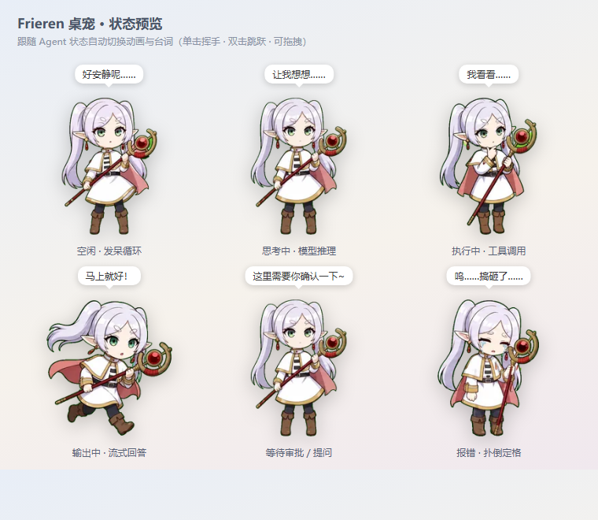

<div align="center">

<h1>Frieren桌宠</h1>

<p>A chibi <b>Frieren</b> desktop pet for the <b>DeepSeek Harness Web GUI</b>
(<code>dsh --profile web</code>).</p>

<p>Idles beside your workspace · follows the Agent's state · waves on its own ·
click to wave, double-click to jump · draggable · remembers where you left it.</p>

<p>
  <a href="#install">Install</a> · <a href="#interactions">Interactions</a> ·
  <a href="#how-it-works">How it works</a> · <a href="#development">Development</a>
</p>

</div>

---

## Preview



The pet follows the Agent's state — idle, thinking, executing tool calls,
streaming output, waiting for approval, and collapsed on errors — each with
its own animation and speech bubble.

## Install

One command. The plugin installs into the `web` profile as a standard
[dsh bundle](https://github.com/deepseek-ai/deepseek-harness) (the same
mechanism the bundled dsh web surfaces use):

```sh
dsh plugin --profile web add github:dakeshui123/dsh-pet-frieren
```

Then (re)start the GUI and Frieren is there:

```sh
dsh --profile web
```

- **Update:** `dsh plugin --profile web update dsh-pet-frieren`
- **Pin a release:** `dsh plugin --profile web add github:dakeshui123/dsh-pet-frieren#v0.1.0`
- **Remove:** `dsh plugin --profile web remove dsh-pet-frieren`
- **Install from git directly:**
  `dsh plugin --profile web add git+https://github.com/dakeshui123/dsh-pet-frieren.git`

> The plugin ships its client bundle prebuilt (no `prepare`/build step), so it
> installs cleanly with any pnpm version — no `allowBuilds` fiddling required.

## Interactions

| Action | Effect |
| --- | --- |
| (nothing) | Follows the Agent: idle loop while free; thinking while the model reasons; runs while streaming output; executes tool calls; waits on approvals/questions; reviews plan-mode plans; collapses on agent errors (holds the last failed frame until the error clears). Switching sessions switches the pet's state with it. |
| State change | Says a short line in a speech bubble (fades after ~3.5 s) |
| Wait (idle only) | Waves every 12–30 s, occasionally jumps every 45–90 s, chats now and then (20–40 s) |
| Click | Wave once |
| Double-click | Jump once |
| Drag | Move the pet (position is remembered); running-left/right while dragged sideways |
| Hover | A small ✕ appears in the corner — click to hide the pet |
| Hidden badge | Click to bring the pet back; drag to move the pet's home |

`prefers-reduced-motion` is respected: the pet shows a static frame of the
current agent state (no auto or click animations, no drag run animation).

## How it works

A dsh plugin is an npm package that declares `dsh.bundle.patch` (a
`cordis.patch.yml` profile layer) plus a `dsh.client` browser half:

```text
dsh-pet-frieren/
├── package.json          dsh.bundle.patch → cordis.patch.yml;
│                         dsh.client { platform: "web" } → exports["./client"]
├── cordis.patch.yml      inserts the plugin's own row into the web profile
├── lib/index.js          node half: serves the runtime assets over HTTP
├── lib/client.js         browser half: the pet overlay (prebuilt bundle)
├── assets/spritesheet.webp   petdex v1 atlas: 8×9 grid of 192×208 px frames
├── assets/pet.json       petdex-format pet manifest (assets/ is the pet folder)
├── assets/preview.png    README preview render
├── test/client.test.js   zero-dependency smoke tests (`node --test`)
├── README.zh.md          中文说明
└── 使用说明.md            中文使用说明
```

At boot, the dsh `client-modules` node half scans the profile's Loader
entries for `dsh.client` packages, serves `/plugins/dsh-pet-frieren/client.js`,
and injects the boot graph into the page. The browser Loader then materializes
the bundle and calls its `apply(ctx)`, which mounts the pet — a
self-contained DOM overlay animated with `requestAnimationFrame` (no React;
one inject edge: the `sessions` service).

The pet reflects the Agent's state through the client runtime's `sessions`
service: the plugin declares `inject: ["sessions"]`, subscribes to
`sessions.list` (the current session's `running` and `pendingInteraction`),
and to the current session's live snapshot (`lastAgentError`, `runningCalls`,
`partial`). The mapping:

| Agent state | Sprite row |
| --- | --- |
| Agent error (`lastAgentError`) | failed (plays once, holds last frame) |
| Waiting on approval / question | waiting |
| Plan-mode plan review | review |
| Thinking (running, no tool calls yet) | waiting |
| Executing tool calls (`runningCalls`) | review |
| Streaming output (`partial`) | running |
| Idle (default) | idle |

Assets follow the same host-serves / client-reads pattern the dsh bundles
use (the web-app bundle serves its frontend dist the same way): the node half
injects the host `webServer` service and registers the
`/dsh-plugin-assets/dsh-pet-frieren` prefix route, which serves
`assets/spritesheet.webp` (a fixed allowlist — no path traversal surface).
The browser half references the sprite as a plain URL in CSS, so the image is
a normal browser-cached HTTP asset instead of being embedded in the bundle.

## Development

`lib/client.js` is a hand-written bundle in the exact
`window.__ModuleLoader__.load` shape the dsh web module system consumes, so no
build step is needed to ship. The single sprite atlas lives in `assets/` and
is served verbatim by the node half. Tests are zero-dependency:

```sh
node --test
```

## Pet format

The `assets/` folder is also a valid [Petdex](https://petdex.dev)-format pet
folder (`pet.json` + `spritesheet.webp`), so the same art can be submitted to
the Petdex gallery (`npx petdex submit assets`). Frame counts used by the
animations match the populated cells of the atlas:

| row | state | frames |
| --- | --- | --- |
| 0 | idle | 6 |
| 1 | running-right | 8 |
| 2 | running-left | 8 |
| 3 | waving | 4 |
| 4 | jumping | 5 |
| 5 | failed | 8 |
| 6 | waiting | 6 |
| 7 | running | 6 |
| 8 | review | 6 |

## License & IP

Code and this fan-art arrangement: [MIT](./LICENSE).
"Frieren" is a character from *Frieren: Beyond Journey's End*
(葬送のフリーレン) by Kanehito Yamada and Tsukasa Abe; the artwork here is
personal, non-commercial fan art. See [LICENSE](./LICENSE) for the full note.

---

<div align="center">

**中文文档：[README.zh.md](./README.zh.md) · [使用说明](./使用说明.md)**

</div>
